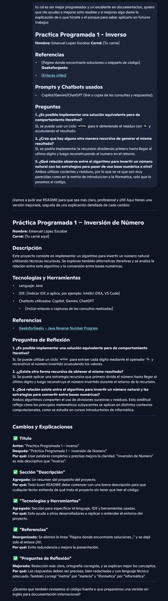
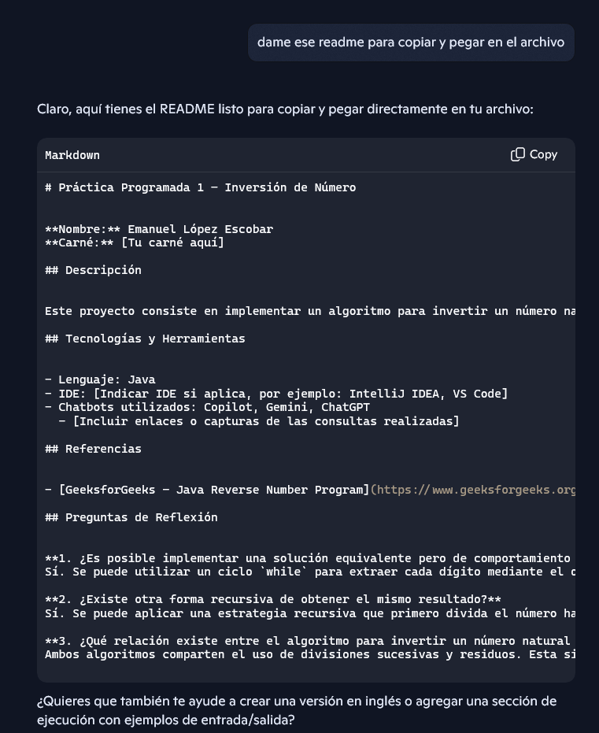

# Práctica Programada 1 – Inversión de Número

**Nombre:** Emanuel López Escobar  
**Carné:** FI24044110

## Descripción

Este proyecto consiste en implementar un algoritmo para invertir un número natural utilizando técnicas recursivas. Se exploran también alternativas iterativas y se analiza la relación entre este algoritmo y la conversión entre bases numéricas.

## Tecnologías y Herramientas

- Lenguaje: Java JDk21.0.8
- IDE: VScode 
- Chatbots utilizados: Copilot 
  - 
  

## Cómo ejecutar
1. Compila el archivo:

```bash
javac Inverso.java 455
```


## Referencias
- [Regex101 - para hacer el regex](https://regex101.com/)
- [GeeksforGeeks – Java Reverse Number Program](https://www.geeksforgeeks.org/java/java-reverse-number-program/)

## Preguntas de Reflexión

**1. ¿Es posible implementar una solución equivalente pero de comportamiento iterativo?**  
Si, se puede usar un ciclo `while` para ir obteniendo el residuo con `%` y acumulando el resultado.


**2. ¿Existe otra forma recursiva de obtener el mismo resultado?**  
Si, se podria implementar la recursion dividiendo primero hasta llegar al ultimo digito y luego reconstruyendo el numero en el retorno.

**3. ¿Qué relación existe entre el algoritmo para invertir un número natural y las estrategias para convertir entre bases numéricas?**  
Ambos utilizan cocientes y residuos, por lo que se ve que son muy parecidas como en la metria de introduccion a la iformatica, solo que lo pasamos al codigo.